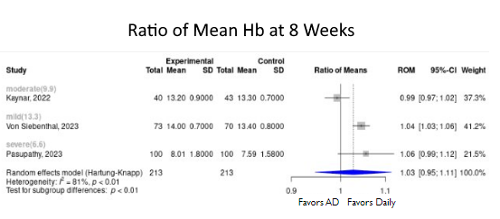

Anemia of iron deficiency treatment with oral iron
============================================
A living systematic review

Short url: https://openmetaanalysis.github.io/anemia/

**Clinical summary:** This meta-analysis suggests that alternate day oral iron versus daily dosing *is* effective in the treatment of iron deficiency anemia with lower incidence of gastrointestinal adverse drug reactions (ADRs). Heterogeneity of results as measured by I2 was '[Moderate](https://training.cochrane.org/handbook/current/chapter-10#section-10-10-2)' at 41%. This review updates previously published meta-analysis(es).(citation[s] below)
<!---
Meta-regression of common modulators (year of publication, study size, event rate in the control groups) finds that the outcome of the intervention is effected by xx.

* [Reconciliation of studies and conclusions with prior meta-analyses](files/reconciliation-tables/Reconciliation%20of%20studies%20and%20conclusions.pdf)
* [Keep current with this topic](files/searching/Keep-up.md)
--->
Acknowledgement: we acknowledge the essential work by the authors of the prior [systematic review(s)](#systematic-reviews) listed below.

**Methods overview:** This repository is an [openMetaAnalysis](https://openmetaanalysis.github.io/) that combines methods of scoping, rapid, and living systematic reviews.  This analysis updates a previously published systematic review below. A comparison of studies included in this review compared to prior reviews are in the table, [reconciliation of trials included with prior meta-analyses/](files/reconciliation-tables/Reconciliation%20of%20studies.pdf). Newer studies included are listed in the references below. Rationale for newer trials excluded may be listed at the end of the references. 
* [Methods](http://openmetaanalysis.github.io/methods.html) for openMetaAnalysis
* [Evidence search](files/searching/evidence-search.md) for this review (under construction)

**Results:** Details of the studies included are in the:
* [Description of studies (PICO table)](files/study-details/table-pico.pdf) (under construction)
<!---
* [Reconciliation of studies and conclusions with prior meta-analyses](files/reconciliation-tables/Reconciliation%20of%20studies%20and%20conclusions.pdf) (under construction)
* [Risk of bias assessment](files/study-details/table-bias.pdf) (under construction)
--->
* [Forest plots](../master/files/forest-plots) ([spreadsheets with source data](files/data))
<!---
* [Network plots](../master/files/network) (optional)
--->
The forest plot for the primary outcomes are below. Additional [forest plots](files/forest-plots) of secondary analyses may be available. 

The meta-regression for the primary outcomes are below. Additional [meta-regressions](files/metaregression) of secondary analyses may be available. 

<!---
The GRADE Profile is below. 
--->
References:
----------------------------------

### Systematic review(s)
#### Most recent review at time of last revision of this repository
1. Kamath S, Parveen RS, Hegde S, Mathias EG, Nayak V, Boloor A. Daily versus alternate day oral iron therapy in iron deficiency anemia: a systematic review. Naunyn Schmiedebergs Arch Pharmacol. 2023 Nov 18. doi: 10.1007/s00210-023-02817-7. Epub ahead of print. PMID: 37979057.

### Randomized controlled trials
#### New trial(s) *not* included in the most recent review above
1. Jongkraijakra S, Doungngern T, Sripakdee W, Lekhakula A. A randomized controlled trial of thrice-weekly versus thrice-daily oral ferrous fumarate treatment in adult patients with iron-deficiency anemia. Ann Hematol. 2023 Jun;102(6):1333-1340. doi: [10.1007/s00277-023-05198-2](http://dx.doi.org/10.1007/s00277-023-05198-2). Epub 2023 Apr 3. PMID: [37010569](http://pubmed.gov/37010569).
2. von Siebenthal HK, Gessler S, Vallelian F, Steinwendner J, Kuenzi UM, Moretti D, Zimmermann MB, Stoffel NU. Alternate day versus consecutive day oral iron supplementation in iron-depleted women: a randomized double-blind placebo-controlled study. EClinicalMedicine. 2023 Nov 3;65:102286. doi: 10.1016/j.eclinm.2023.102286. PMID: [38021373](http://pubmed.gov/38021373). 
   

#### Trial(s) included in the review above

#### Trial(s) undergoing review
None

#### Trial(s) excluded - selected list of important trial(s)

#### Cited by
This repository is cited by:

1. WikiDoc contributors. Pending content page. WikiDoc. Nov 9, 2014. Available at: http://www.wikidoc.org/index.php/This_topic. Accessed November 9, 2014. 

-------------------------------
[Cite and use this content](https://github.com/openMetaAnalysis/openMetaAnalysis.github.io/blob/master/reusing.MD)  - [Edit this page](../../edit/master/README.md) - [License](files/LICENSE.md) - [History](../../commits/master/README.md)  - 
[Issues and comments](../../issues?q=is%3Aboth+is%3Aissue)

